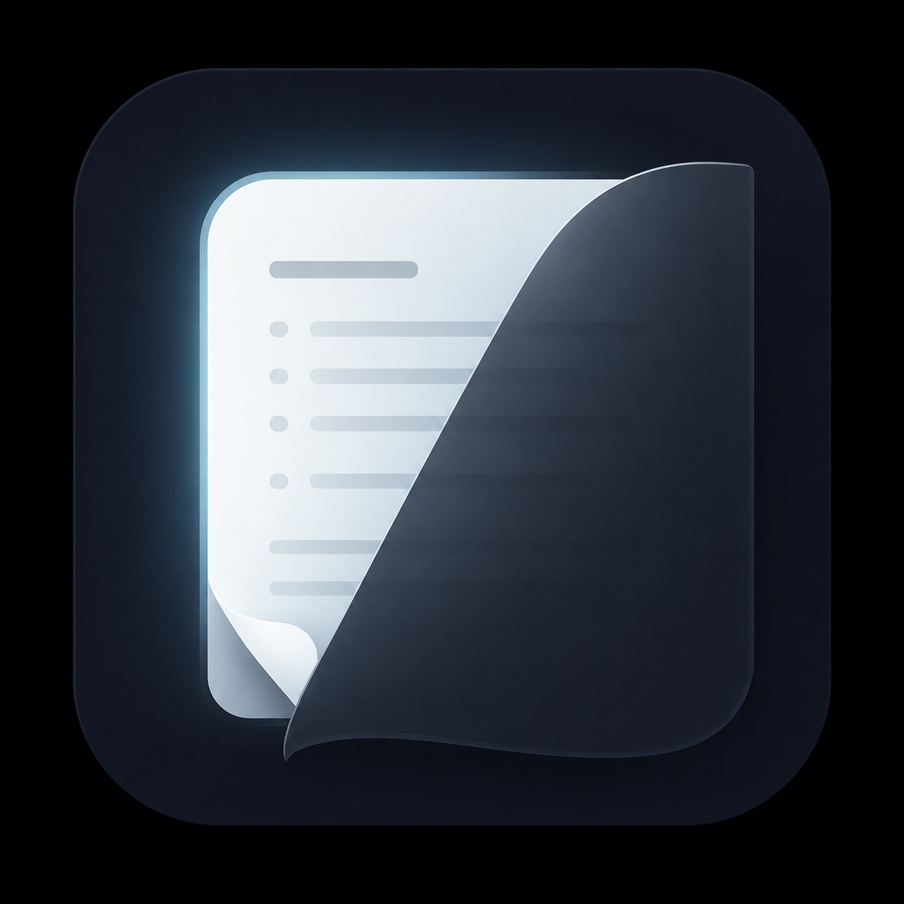
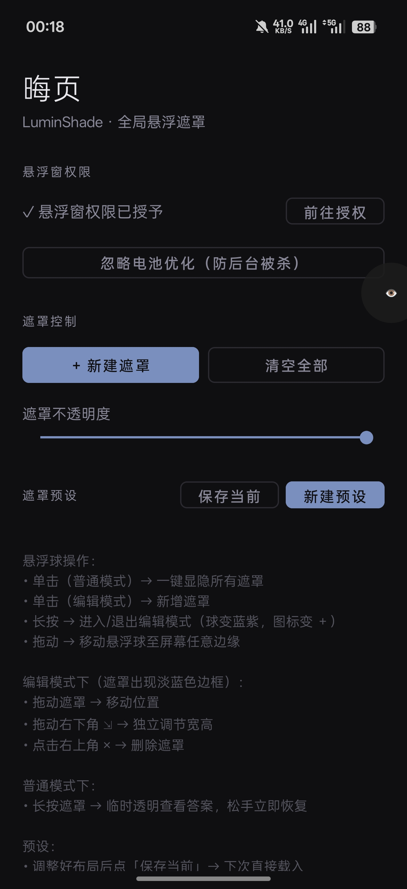
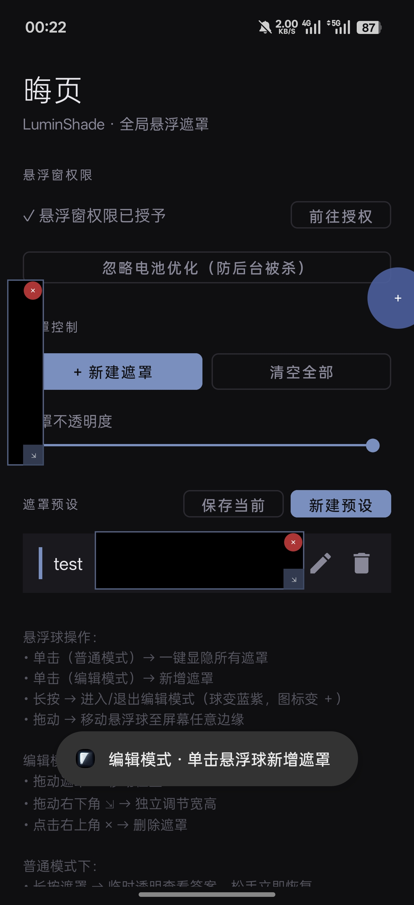
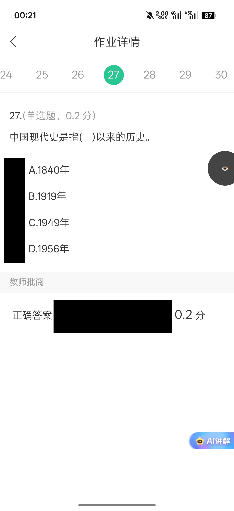

<div align="center">



# LuminShade · 晦页

**一款专为刷题复盘打造的开源安卓全局悬浮遮罩工具**

[](LICENSE)
[](#)
[](#)
[](#)
[](#)

</div>

---

## 项目缘起

**晦页**取自书卷意境：「晦」代表遮蔽隐藏，「页」对应习题、试卷页面。

刷题时答案和题干往往同屏显示，靠手挡、靠便利贴遮答案的复盘体验都不够清爽。市面上同类工具要么绑定具体阅读器、要么塞满广告与冗余功能。LuminShade 只做一件事——**在任意应用上层悬浮纯黑遮罩**，让你独立思考、按需揭晓答案。

## 设计原则

- **极致专一**：只做遮挡，不做笔记、搜题、截图、录屏
- **轻量**：Release APK 约 2.6 MB，依赖仅限 AndroidX / Material Components 等官方库，无任何第三方 SDK
- **极致克制**：仅申请 `SYSTEM_ALERT_WINDOW` 一项权限
- **完全离线**：无网络请求、无埋点、无广告、无推送、无统计
- **清冷调性**：低饱和深色 UI，无花哨动效，专注学习场景

## 核心功能

### 全局悬浮遮罩
跨应用悬浮黑色矩形，覆盖 PDF 阅读器、图片相册、网页浏览器、网课 App、电子试卷截图等**所有应用**的答案/解析区域。

### 一键显隐悬浮球
屏幕边缘常驻悬浮球，**单击瞬间切换所有遮罩可见性**——做题时遮挡、对答案时一键揭晓，再次单击恢复遮挡继续下一题。

### 编辑模式与普通模式分离
- **普通模式**：遮罩纯净无装饰，长按任意遮罩可临时透明窥视下方内容，松手即恢复
- **编辑模式**：遮罩出现淡蓝边框，可自由拖动位置、独立调节宽高、单击删除

### 预设布局保存
为不同试卷（数学卷、英语卷、专业课真题等）保存独立的遮罩布局预设，切换时无需重新拖拽。

### 透明度调节
全局滑块控制所有遮罩的不透明度，从纯黑完全遮挡到半透提示。

## 交互一览

| 手势 | 行为 |
|------|------|
| **单击悬浮球**（普通模式） | 切换所有遮罩显示/隐藏 |
| **单击悬浮球**（编辑模式） | 新增一个遮罩 |
| **长按悬浮球** | 进入 / 退出编辑模式（球变蓝紫，图标变 ＋） |
| **拖动悬浮球** | 移动至屏幕任意边缘（自动吸附） |
| **拖动遮罩**（编辑模式） | 移动位置 |
| **拖动遮罩右下角 ⇲**（编辑模式） | 独立调节宽高，不锁比例 |
| **点击右上角 ×**（编辑模式） | 删除该遮罩 |
| **长按遮罩**（普通模式） | 临时透明窥视下方答案，松手立即恢复 |

## 截图

<table>
  <tr>
    <td align="center"></td>
    <td align="center"></td>
    <td align="center"></td>
  </tr>
  <tr>
    <td align="center"><b>主界面</b><br/><sub>权限引导、预设管理、透明度调节</sub></td>
    <td align="center"><b>编辑模式</b><br/><sub>遮罩淡蓝边框、× 删除按钮、悬浮球变 ＋</sub></td>
    <td align="center"><b>实战刷题</b><br/><sub>跨应用悬浮，遮挡答案选项与正确答案</sub></td>
  </tr>
</table>

## 安装

### 从 Releases 安装（推荐）
前往 [Releases](../../releases) 页面下载最新版后安装

### 首次使用配置
1. 打开晦页，按引导前往「**显示在其他应用上层**」设置授权
2. （可选）前往「**电池优化**」设置，将晦页设为「**不优化**」以防被系统进程杀掉
3. 返回主界面，点击「**+ 新建遮罩**」开始使用

## 从源码构建

### 环境要求
- JDK 17 或更高（项目使用 Java 21 测试）
- Android SDK Platform 34 + Build Tools 34.0.0
- Gradle 8.4 ~ 8.7

### 构建命令
```bash
git clone https://github.com/buerka/LuminShade.git
cd LuminShade
./gradlew assembleDebug          # 调试版
./gradlew assembleRelease        # 正式版（含混淆压缩）
```

构建产物：
```
app/build/outputs/apk/debug/app-debug.apk
app/build/outputs/apk/release/app-release-unsigned.apk
```

### 国内构建加速
若 Maven Central / Google 仓库下载缓慢，可在 `~/.gradle/init.gradle` 添加阿里云镜像（项目根目录提供了示例）。

## 技术栈

| 项目 | 选型 |
|------|------|
| 语言 | Kotlin 1.9.22 |
| 构建工具 | Gradle 8.4 + Android Gradle Plugin 8.2.2 |
| 编译 SDK | compileSdk 34（targetSdk 34，minSdk 28） |
| JVM Target | Java 8 |
| UI 框架 | 原生 Android View + ViewBinding（无 Compose / 无 DataBinding） |
| 依赖库（共 4 项） | `androidx.core:core-ktx:1.12.0`<br>`androidx.appcompat:appcompat:1.6.1`<br>`com.google.android.material:material:1.11.0`<br>`androidx.constraintlayout:constraintlayout:2.1.4` |
| 持久化 | `SharedPreferences` + 系统自带 `org.json`（零序列化库依赖） |
| Release 打包 | R8 代码混淆 + 资源压缩（`minifyEnabled` + `shrinkResources`） |

**核心实现：**
- `WindowManager` + `TYPE_APPLICATION_OVERLAY` 实现全局悬浮层
- 自定义 `View.onDraw` / `onTouchEvent` 处理拖动、角点缩放、长按 peek
- `Service` + 前台通知（Android 14+ 使用 `FOREGROUND_SERVICE_TYPE_SPECIAL_USE`）保活
- 全程无任何反射、无任何动态加载、无任何后台定时任务

### 项目结构

```
app/src/main/
├── AndroidManifest.xml         仅声明 SYSTEM_ALERT_WINDOW 与前台服务
├── java/com/luminshade/
│   ├── MainActivity.kt         主界面：权限引导、预设管理、透明度调节
│   ├── OverlayService.kt       前台服务：管理所有悬浮层生命周期
│   ├── MaskView.kt             遮罩自定义视图：拖动 / 角点缩放 / 长按 peek
│   ├── FloatingBallView.kt     悬浮控制球：边缘吸附 / 短按 / 长按 / 拖动
│   ├── PresetAdapter.kt        预设列表 RecyclerView 适配器
│   ├── PresetManager.kt        预设持久化（SharedPreferences + JSON）
│   └── data/
│       ├── MaskData.kt         单块遮罩数据模型
│       └── PresetData.kt       预设数据模型
└── res/                        极简深色主题资源
```

## 隐私声明

晦页**不收集、不上传、不分析任何数据**：

- ❌ 无任何形式的网络请求
- ❌ 无埋点 / 统计 / 行为分析 SDK
- ❌ 无广告 / 推送 / 个性化推荐
- ❌ 不读取存储 / 相机 / 定位 / 通讯录 / 任何用户文件
- ✅ 仅本地保存预设布局（位于应用私有目录的 SharedPreferences）

## 开源协议

本项目基于 [MIT License](LICENSE) 开源。

```
MIT License — 你可以自由使用、修改、分发本软件，
仅需在副本中保留原始版权与许可声明。
```
